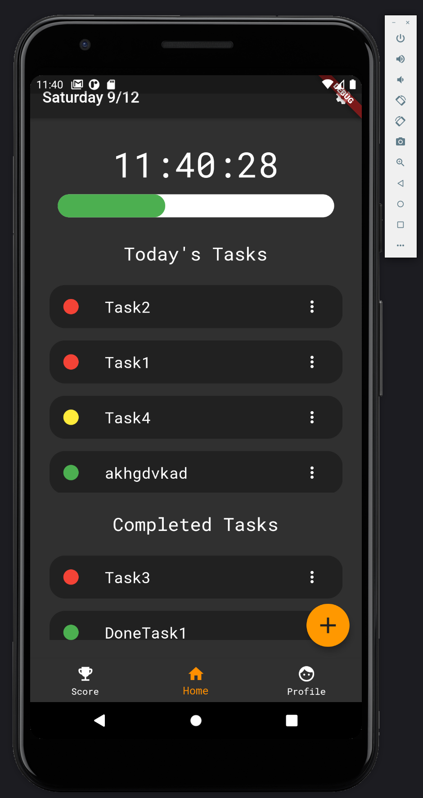
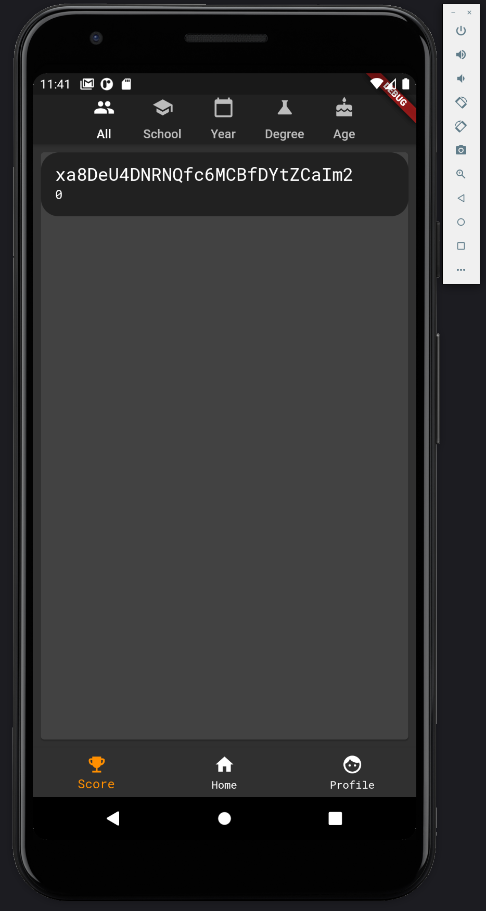

# Prog_Tracker

## Objective
To create an tool which allows the user better track tasks throughout the day.

## Core Stack
  - Flutter (Dart)
  - Firebase

### Dart-Dependencies Used 
  - google_fonts: ^1.1.0
  - firebase_core: ^0.4.5
  - firebase_auth: ^0.16.1
  - google_sign_in: ^4.5.1
  - cloud_firestore: ^0.13.7
  - firebase_database: ^3.1.6
  - rxdart: ^0.24.1
  - intl: ^0.16.1
  - charts_flutter: ^0.9.0  
  - percent_indicator: ^2.1.5
  

## Platforms Supported
  - Mobile
    - iOS > 10.1
    - Android > 8.0
  - Web
  - (Desktop App coming)
  
## Images 

This is the home screen where the un/completed tasks are presented.
The bar at the top represents your progress for the day and is dynamic.
From this screen, you have the ability to edit tasks, complete tasks, and add new tasks.

This is a "leaderboard" page I made for fun.
It allows you to see your rank among others on the platform and sort them by your preference.
It's creation allowed me to work with Firebase more and learn more about NoSQL database structures.

## Demo
Web Version migrated from mobile version, 
test here, using google sign in:
https://jonathanconn.github.io/prog_tracker_app/
